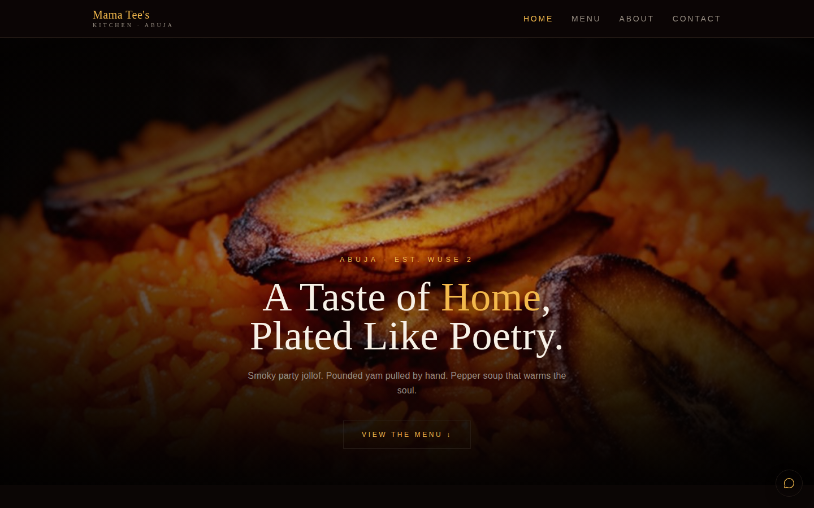
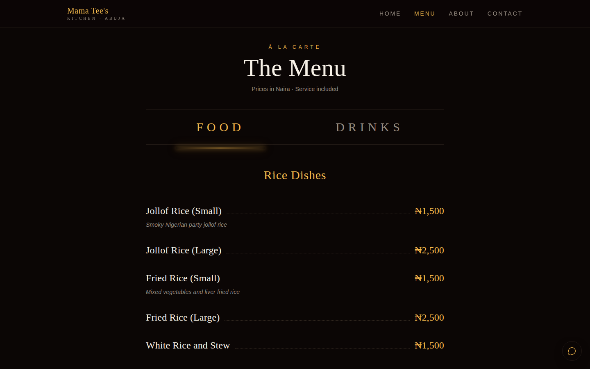
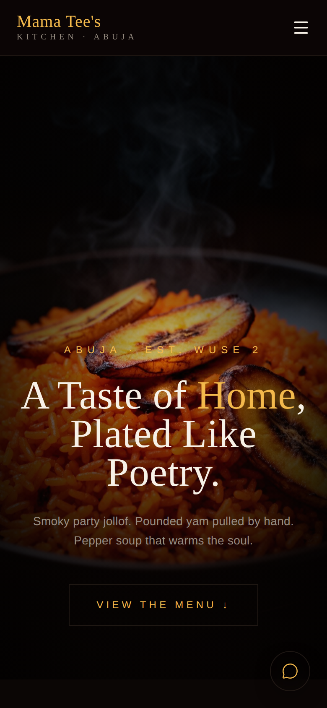

# Mama Tee's Kitchen

A website for **Mama Tee's Kitchen**, a Nigerian restaurant in Wuse 2, Abuja. On the site you can:

- browse the menu
- see the weekly specials
- read the restaurant's story
- **order by talking to an AI voice assistant** in your browser

Built by Michael Awude (MikeOps) as my capstone project.

**Live site: [mama-tees-menu.vercel.app](https://mama-tees-menu.vercel.app)**



| Menu | On a phone |
| --- | --- |
|  |  |

## Features

- **Menu** with Food and Drinks tabs, prices in naira. Sections: rice dishes, swallow & soup, proteins, and small chops & snacks.
- **Specials:** Friday catfish pepper soup and the Sunday family meal deal.
- **Voice ordering:** press the mic and talk to **Ada**, the restaurant's AI assistant, built with [Vapi](https://vapi.ai). She greets you and takes your order by voice, right in the browser. There's also a full page for her at `/assistant`.
- **WhatsApp button** on every page, for customers who prefer to chat.
- **About** and **Contact** pages with the address and phone number.
- **Responsive design** for phones and desktops, with smooth animations.
- **Search-ready:** each page has its own title and description.

## Built with

| | |
| --- | --- |
| Framework | [TanStack Start](https://tanstack.com/start) with React 19 and TanStack Router (file-based routes in `src/routes/`) |
| Language | TypeScript |
| Styling | Tailwind CSS 4, shadcn/ui components (Radix UI), Motion for animation |
| Voice AI | Vapi Web SDK (`@vapi-ai/web`) |
| Build | Vite 7 |
| Hosting | Vercel |

## Pages

| Route | Page |
| --- | --- |
| `/` | Home: hero, best sellers, specials and the voice assistant |
| `/menu` | Full menu, Food and Drinks |
| `/specials` | Weekly specials |
| `/about` | The story behind Mama Tee's |
| `/contact` | Address, opening hours, phone |
| `/assistant` | Talk to Ada, the voice assistant |

## Run it locally

You need Node.js 20 or newer.

```bash
npm install
npm run dev
```

Then open the local address it prints.

### Voice assistant set-up

The voice assistant needs a [Vapi](https://vapi.ai) account. Create a file called `.env` in the project folder:

```
VITE_VAPI_PUBLIC_KEY=your-vapi-public-key
VITE_VAPI_ASSISTANT_ID=your-assistant-id
```

Use Vapi's **public** key. It's built into the website, so it must never be the private (server) key. `.env` is already in `.gitignore`, so it is never committed. On Vercel, add the same two variables under **Project → Settings → Environment Variables**.

The rest of the site works without them; only the mic button needs them.

## Scripts

| Command | What it does |
| --- | --- |
| `npm run dev` | Start the site locally with live reload |
| `npm run build` | Build for production into `dist/` |
| `npm run preview` | Serve the production build locally |
| `npm run lint` | Check the code with ESLint |
| `npm run format` | Format the code with Prettier |

## Project structure

```
src/
  routes/       one file per page (TanStack Router)
  components/   header, footer, voice assistant, WhatsApp button, ui/ (shadcn)
  assets/       food photography
  styles.css    theme and global styles
docs/           screenshots for this README
```
